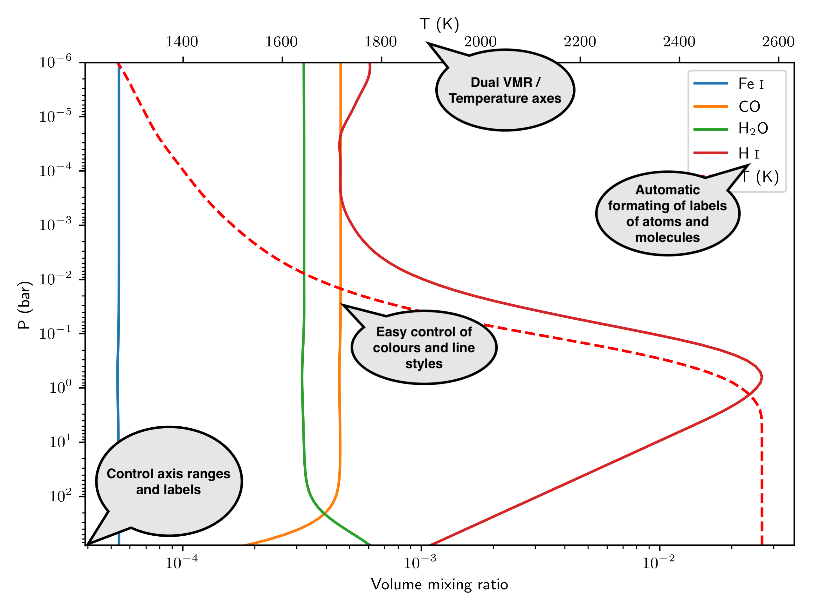

# Plot_FastChem
This is a little object to read and quickly plot the chemical abundance profiles produced by FastChem. This ReadMe continues to describe the contents of this repo, which form a minimum set of files needed to run this code. The end-product of this code is a graph of the equilibrium chemistry in astrophysical objects, like the following:



First, install and run FastChem (<https://github.com/exoclime/FastChem>). In this example, I ran the FastChem demo for Kepler-7b. This has produced at least one in the `output/` folder, containing the abundance profiles (output/chem_output.dat).


## Minimum working example
Start python, import the FCO object and run it on the output file we wish to plot the chemistry from:

```python
from plot_fastchem import FastChem_output as FCO
a = FCO('output/chem_output.dat')
```

This immediately makes and shows a matplotlib figure, with the abundance profiles of iron, CO, water and atomic hydrogen by default, as well as the temperature profile. Having made this object, the user can edit what to plot and where to save the figure, by changing class attributes and exuting class methods of the FCO object `a`:

```python
a.plot_Tcolor = 'green'
a.Tstyle = '-'
a.styles = ['--']
a.plot_species=['H','Na','Mg','K','Ca','Fe','O1Ti1']
a.outpath = 'Kepler_7_chemistry.png'
a.plot()
```
This first changes the colour of the TP profile to green, then changes its linestyle to solid, then changes the styles of all the abundance profiles to dashed, then provides a path to write the figure to, and finally executes the plotting again. The labels of some molecules are defined in FastChem in non-conventional orders and are not automatically resolved. These need to be set manually. To set the label of TiO in the above example while retaining the automatic formatting of the other labels, you can add:

```python
a.labels=[a.resolve(i) for i in ['H','Na','Mg','K','Ca','Fe']]+['TiO']
a.plot()
```

Below is the header of the init method of the FCO object, including an overview of all the attributes and methods that can be used.

## Notes on compatibility
1) This code is designed to work with the chemistry output of FastChem 2. It will still work with FastChem 1 (<https://github.com/exoclime/FastChem>), but the species labels will not be formatted properly in the legend.
2) To run this code, you need to have astropy (<https://www.astropy.org>) installed.

```python
        """
        Initialise the FastChem output class used to plot the output of FastChem.
        Parameters
        ----------
        p : file path
            File to read the output from.
        plot_species: list of strs
            A list containing the FastChem labels of the species to be plotted.
            If a label is set wrongly, the code will abort, printing the available
            labels as recognised from the map-file.
        outpath: file path
            Optional outpath of the figure that is going to be plotted. If not set,
            or set to '', no figure will be written, and the plot is shown on screen instead (default).
        nowhow: Bool
            Set to true if you want to skip plotting on init, if you plan to call the .plot() method later.
        Returns
        -------
        FastChem_output : `FastChem_output` object
            Upon init, this object will plot the default species, either to screen if outpath is
            not set (default), or to file if outpath is set.

        Attributes
        -------
        self.plot_species: list of str
            Same as plot_species above. Used to change the list of species to plot
            after init.

        self.ymin: int,float
            Maximum x-axis range.
        self.ymax: int,float
            Maximum x-axis range.
        self.xmin: int,float
            Maximum x-axis range.
        self.xmax: int,float
            Maximum x-axis range.
        self.xlabel: str
            The label of the x-axis. Volume mixing ratio by default.
        self.ylabel: str
            The label of the y-axis. P (bar) by default.


        self.outpath: file path
            See above.
        self.fontsize: int
            Font size of the axes and labels.
        self.dpi: int
            DPI of the output figure.
        self.figsize: tuple
            Figsize, as in the plt.subplots figsize keyword.


        self.colors: list of str
            Matplotlib colour names in a list of arbitrary length. The species lines to plot
            will cycle through this list rather than the default. Can be used to specify the colour
            of each single element.
        self.styles: list of str
            Matplotlib short-hand line styles (':','-.','--','-') in a list of arbitrary length.
            The species lines to plot will cycle through this list. Set to '-' by default, meaning
            that all lines will be solid.
        self.labels: list of str
            Manually set the species labels. You probably need this for making paper-ready figures. If you set a label to '', the line will be ignored in the legend.
            If you set fewer labels than species, the trailing species will not make it into the legend.
        self.alpha: list of float
            Transparency values of lines. Same philosophy as colours and styles.
        self.linewidth: list of float
            Line thicknesses.
        self.Tcolor: str
            Matplotlib colour of the temperature profile on the second axis.
        self.Talpha: float
            Transparency value of the TP profile.
        self.Tstyle: str
            Matplotlib short-hand line style for the TP profile.
        self.plot_TP: Bool
            Turn plotting of the TP profile on or off. On by default.


        Methods
        -------
        self.print_species()
            Print the FastChem labels of all available species that can be included
            in plot_species.
        self.resolve(name)
            Takes a species name as a string as input (e.g. H2O1), for use in the figure legend.
        self.plot(show==False)
            Re-plot the Figure (after changing the plot parameters for instance).
            set show==True to force plotting the Fig. on-screen, even if outpath is set.
        """
```
